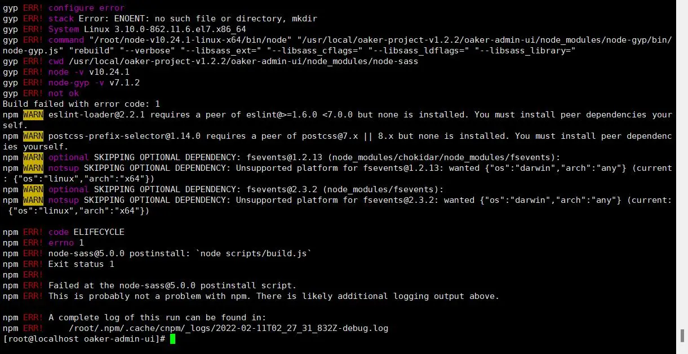
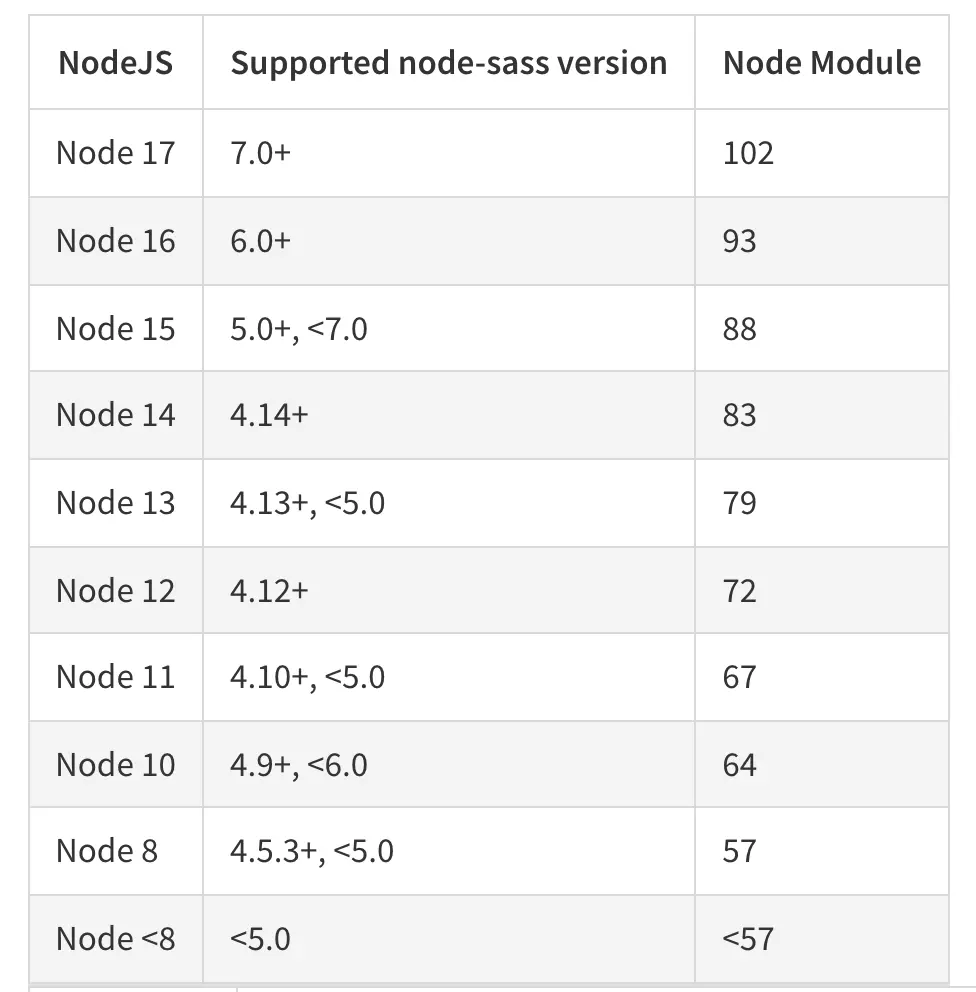
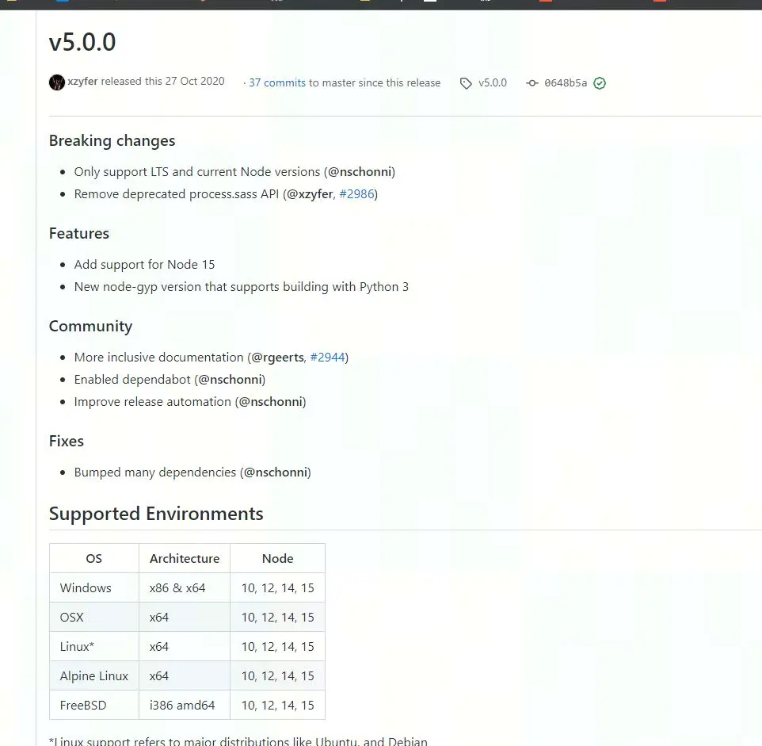

# 项目编译


## 后端编译

拉取代码后，用mvn 命令或者ide 进行编译。


## 前端编译

### 构建环境

```
#克隆前端代码

git clone https://gitee.com/wy-soft/wyproject-web

# 安装依赖  如果网速太慢，请使用下方明年了
npm install

# 建议不要直接使用 cnpm 安装依赖，会有各种诡异的 bug。可以通过如下操作解决 npm 下载速度慢的问题
npm install --registry=https://registry.npm.taobao.org


#  如遇到node-sass安装问题可执行以下命令通过cnpm单独安装

npm uninstall node-sass

# 安装cnpm
npm install -g cnpm --registry=https://registry.npmmirror.com

# 重新安装node-sass

cnpm install -D node-sass@5.0.0 --save

# 启动服务
npm run dev

```

### 打包发布

```
# 构建测试环境
npm run build:stage

# 构建生产环境
npm run build:prod

```


### node-sass报错说明
在使用node对前端代码进行编译时，有时会出现编译错误。




原因
这是因为node-sass与node版本不匹配导致。
Node和node-sass的版本存在绑定关系，关系对照表如下：



本项目使用的是node-sass5.0版本，官方也有对应版本说明。




解决方案

如果你使用的node版本在官方推荐的版本列表中，编译就没有没有，否则就会出现上文描述的bug，有两种解决方案

node 升级或降级到目标版本
```
sudo rm -rf /usr/local/{bin/{node,npm},lib/node_modules/npm,lib/node,share/man/*/node.*}
# 从下面的网址下载对应系统安装包，
点击安装即可
# https://nodejs.org/download/release/v14.18.2/
```


使用cnpm 单独安装
```
# 安装cnpm
npm install -g cnpm --registry=https://registry.npmmirror.com

# 卸载之前的node-sass

npm uninstall node-sass

# 重新安装node-sass
cnpm install -D node-sass@5.0.0 --save
```
