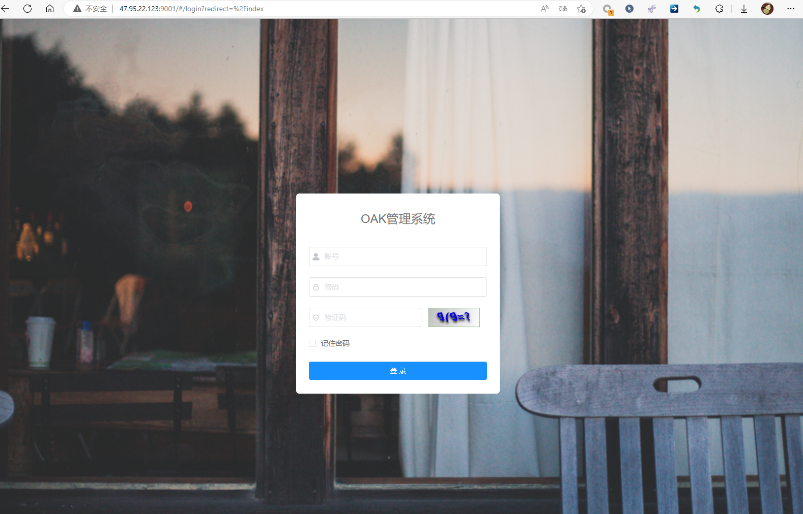

# 直接部署方式

## 0.相关环境准备
相关软件：mysql（或者mariaDB）、redis5.0、nginx。

环境需要：jdk1.8

工具：ssh工具，navicat（或其他数据库工具）

假设已经装好相关mysql，redis、jks和nginx环境了。

##  1.下载后端程序和前端程序

###  通过下载页面选择下载
下载最新的安装包。
下载页面：
[程序下载](http://www.wuyu-soft.com/doc/cost/wycost-downloads/)


###  直接下载最新版本
下载地址：
[工时系统-V0.1版本下载](https://gitee.com/wy-soft/wyproject/releases/tag/wyproject_all-0.1)

下载后将程序包上传到服务器上。


##  2. 部署后端

### 2.1.创建数据库
库名：wy_project ( 必须是这个，请不要自行定义库名）

字符集：utf8mb4

排序规则：utf8mb4_general_ci


导入sql，使用命令行或者navicat 等工具导入mysql文件中的
wy_project_init  文件到 wy_project 数据库中


### 2.2.部署后端程序

1.创建程序目录
```
mkdir /usr/local/wysoft
```

2.移动文件
```
cp   wy_project.jar  /usr/local/wysoft/
cp   wy_ctl.sh  /usr/local/wysoft/
```

3.进入程序目录，并修改配置信息

主要修改内容：

- 数据库密码

- redis端口号

- redis密码

- 上传文件路径 # 可不修改  默认为当前目录下的uploadPath下

```
cd  /usr/local/wysoft
vi  wy_ctl.sh
```


4.启动
```
./wy_ctl.sh  start
```

访问localhostL8080  出现这个界面说明后端部署成功。


5.其他管理
```
#停止
./wy_ctl.sh  stop
#重启
./wy_ctl.sh  restart
#查看状态和日志
./wy_ctl.sh  status
```


## 3.部署前端

1.解压前端文件

```
unzip wy_web.zip
```
如果没有unzip，需要先进行安装.
```
#centos
yum install unzip

#ubuntu
apt install unzip
```

2.复制到程序目录
```
cp -r  wy_web  /usr/local/wysoft/ 
```
3.复制nginx配置文件

将wy_nginx.conf  放到nginx的conf.d 目录下

这里需要的nginx的安装目录

```
## 安装在 /etc/nginx/下
cp  wy_nginx.conf /etc/nginx/conf.d/

## nginx安装在/usr/local/nginx下
cp -r  wy_web  /usr/local/nginx/conf/conf.d/
```


4.修改配置文件（可选，如有冲突，则需要修改对应端口）

默认是端口是80，主机是localhost，可根据自己需求进行修改。

5.重新载入nginx 配置 或者重启nginx。

6.访问 localhost 
能够出现验证码说明前后端均已部署成功。




7.登录访问

使用默认账号登录

默认管理员： admin 

密码：12345678
